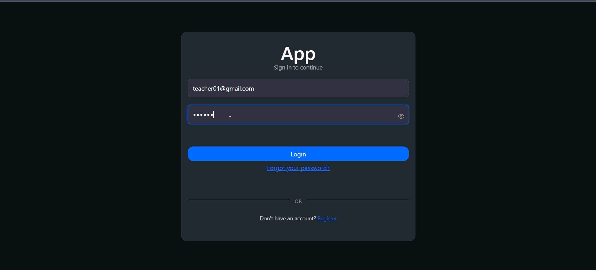
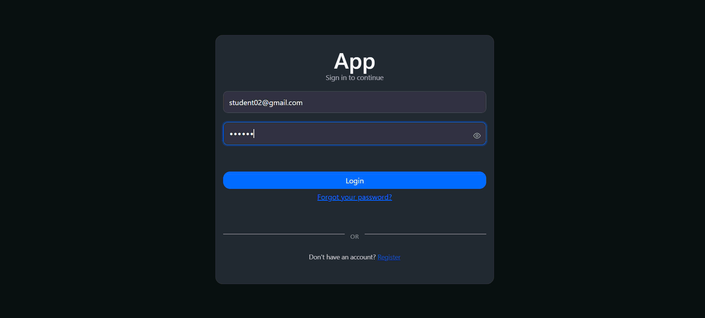

# Project Overview

This project is designed to assist both teachers and students in achieving their educational goals. The platform provides tools for publishing educational content and tracking academic progress, fostering an interactive and engaging learning environment.
[Check it out](https://subjects-easy-rho.vercel.app/) 

## Features

### For Teachers:
- Publish videos on various school subjects to share knowledge with students.
- Monitor the progress and evolution of students in specific subjects.
- 

### For Students:
- Access and watch educational videos published by your teachers.
- Enhance your understanding of school subjects through guided content.
- 

## Getting Started

1. **Sign Up**:
   - Create an account by selecting your role as either a teacher or a student.
2. **For Teachers**:
   - Start by publishing videos on the subjects you teach.
   - View student progress reports to better tailor your teaching strategies.
3. **For Students**:
   - Browse and watch videos posted by your teachers.
   - Track your learning journey and improve your knowledge.

## How to Use

- Teachers and students can interact with the platform through a simple and user-friendly interface [here](https://subjects-easy-rho.vercel.app/) .
- Teachers upload video content directly through their accounts.
- Students access the videos via their dashboards and can view them at any time.

### Running locally

**Prerequisites**
- [Node.js](https://nodejs.org/) (v18+)
- A [MongoDB](https://www.mongodb.com/) database (Atlas or local)
- (Optional) AWS credentials — only needed to test the S3 upload/HLS pipeline, see [Code Architecture](#code-architecture)

**1. Clone the repository**
```bash
git clone https://github.com/zBlasius/subjects_easy.git
cd subjects_easy
```

**2. Set up the server**
```bash
cd server
npm install
```
Create a `.env` file inside `server/`:
```env
user_mongodb=<your MongoDB username>
password_mongodb=<your MongoDB password>
SECRET_MONGODB_KEY=<any secret string used to sign sessions>

# Optional - only needed for file upload / HLS processing
AWS_ACCESS_KEY_ID=
AWS_SECRET_ACCESS_KEY=
AWS_REGION=
AWS_S3_BUCKET_NAME=
AWS_SQS_QUEUE_URL=
```

Start the API:
```bash
npm run dev-start
```
The server runs on `http://localhost:8080`, with all routes mounted under `/api`.

**3. Set up the client**
```bash
cd ../client
npm install
```
Create a `.env` file inside `client/`:
```env
REACT_APP_BASE_URL=http://localhost:8080/api
```
Start the app:
```bash
npm start
```
The client runs on `http://localhost:3000` and talks to your local API.

## Code Architecture

In this section, I'd like to talk about two core aspects of this project's backend: how the code is organized, and how file dealing (upload and watching/processing) works.

I designed this codebase around two principles: **Clean Architecture** and **Domain-Driven Design (DDD)**.

### Layered structure

Each module is split into three layers, connected only through interfaces (contracts) rather than concrete implementations — dependency inversion in practice, which makes future maintenance and swapping implementations easier:

- **Application** — Controllers and input validation. Controllers only orchestrate requests: parse/validate the payload (with [Zod](https://zod.dev/) schemas) and call a service through its interface (e.g. `ICourseService`). They know nothing about the database or business rules.
- **Domain** — Services, DTOs and domain models. This is where business rules live (e.g. `CourseService`, `FileService`). Services depend on repository *interfaces* (`ICourseRepository`), never on the concrete MongoDB implementation.
- **Architecture** (`architeture/`) — Repositories that implement the domain contracts and talk to the database (Mongoose). They translate raw MongoDB documents into domain models (e.g. `CourseModel`), so nothing outside this layer touches a Mongoose document directly.


Because every layer only knows the interface below it (`ICourseService`, `ICourseRepository`, `IS3Service`, ...), swapping an implementation — replacing MongoDB with another database, or S3 with another storage provider — only requires a new class that implements the same contract, with no change to controllers or services.

### Dependency Injection with InversifyJS

Wiring between interfaces and concrete classes is handled by **[InversifyJS](https://inversify.io/)**. Each module owns its own `IoC.config.ts`, where every repository/service/controller is registered against a `Symbol`-based `TYPES` map and resolved through constructor injection with `@injectable()` / `@inject()`:

```ts
container
  .bind<ICourseService>(TYPES.CourseService)
  .to(CourseService);
```

Routes never instantiate a class directly — they resolve it from the container instead:

```ts
courseModule.container
  .get<courseModule.IFileController>(TYPES.FileController)
  .create(req, res)
```

This keeps controllers, services and repositories decoupled from each other's concrete implementations and easy to mock in tests.

### Modules as bounded contexts (DDD)

Following DDD, code is grouped by **business capability** instead of by technical type. Each module (`course`, `user`, `mediator`) is a self-contained slice with its own Application/Domain/Architecture layers, its own models and its own IoC container — business rules about authentication and student progress stay inside the `user` module, while everything related to courses and video files stays inside the `course` module.

When a use case needs data from more than one module — e.g. "list the courses a student is currently enrolled in", which needs `Progress` (user module) and `Course` (course module) — one module never reaches directly into another's internals. Instead, a dedicated **`mediator` module** composes the public services of both modules through their interfaces:

```ts
constructor(
  @inject(TYPES.CourseService) private courseService: courseModule.services.ICourseService,
  @inject(TYPES.ProgressService) private progressService: userModule.services.IProgressService
) {}
```

This keeps `course` and `user` fully independent from each other, with all cross-module orchestration isolated in one place.

### File dealing: upload and watching

- **Upload** — a video reaches the API as `multipart/form-data` (via `multer`), gets validated by a Zod schema (`FileCreateSchema`), and flows through `FileController → FileService`. `FileService` uploads the raw file to **AWS S3** (through the `IS3Service` interface) and persists a `File` record through `IFileRepository`.
- **Watching (processing)** — a raw upload isn't playable as an adaptive stream on its own, so a separate worker (`server/ffmpeg`), meant to run independently as an ECS task, downloads the original file from S3 and converts it into **HLS** (`.m3u8` playlist + `.ts` segments) using `fluent-ffmpeg`, then re-uploads the segments back to S3 so the client can stream the video with adaptive playback. This transcoding logic is fully implemented and already working end-to-end.
- The whole pipeline is designed to be event-driven and asynchronous: an **SQS** queue and a background `Job` entity (statuses `CREATED → QUEUED → PROCESSING → DONE/FAILED`) track the transcoding status, with error reporting routed to a logging **AWS Lambda**.
- Right now, the calls that trigger this pipeline are commented out in `FileService` — AWS started charging for the resources this flow depends on (S3/ECS/Lambda/SQS), and I don't currently have the budget to keep them running. The HLS conversion itself works; it's just disconnected from the live upload flow for cost reasons. As soon as I have AWS access again, re-enabling it is just a matter of uncommenting those calls, since the contracts (`ISQSService`, `IJobService`) and the worker are already built and tested.

## Contribution

We welcome contributions to enhance this project. If you have suggestions or improvements, feel free to:
- Submit an issue.
- Create a pull request.

## Future Implementations

I'm planning to unify this project with the idea of my last project: [PhysiLab2d](https://github.com/zBlasius/PhysiLab2d).
I mean, when this repository has main features that can be useful, I want to implement the idea of PhysiLab2d inside this repository

## Contact

For any inquiries or support, please contact blasiusgustavo19@gmail.com
